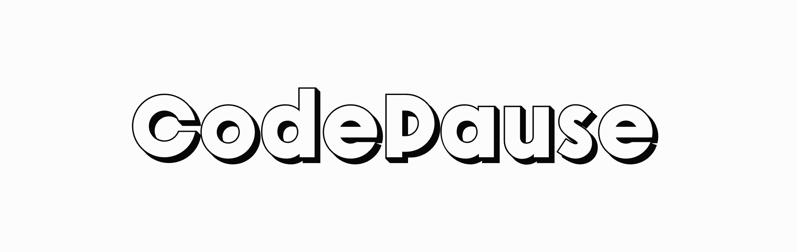

# CodePause
> A minimalist app for developers to combat sedentary work habits with short-timed fitness breaks and quick workout suggestions.

**Watch/Star ⭐ the repo to be notified when updates are pushed**

--

🖥️ **CodePause** is a minimalist, design-focused menubar application aimed at helping developers and combat the 'sitting disease' 🪑 associated with long coding sessions. This lightweight tool seamlessly integrates into your workflow, providing gentle reminders at customizable intervals to take short fitness breaks. ⏰

💪 Designed to help you maintain your health without disrupting your productivity, CodePause offers a clean, system-native interface that blends perfectly with your operating system. With just a click, you can access a variety of quick and effective workout exercises tailored for the office environment. 🏋️‍♂️

**Key features**:

⚙️ Customizable reminder intervals to suit your work style
🧘‍♂️ Curated selection of desk-friendly workout exercises
🎨 Clean, unobtrusive menubar interface
⚡ Quick-access workout suggestions for immediate action
📊 Progress tracking to motivate consistent activity

CodePause is your ally in the fight against sedentary working habits. 🦸‍♂️ By encouraging regular movement and offering simple, effective exercises, it helps developers stay active and healthy, even during intense coding sessions. Say goodbye to the negative effects of prolonged sitting and hello to a more energized, focused, and healthier coding experience! 🎉💻

## Demo
You can visit the CodePause demo app here [https://codepause.vercel.app/demo/]. 

## Get Started
### Requirements
### Installation and Usage

## TODO/Features
- **TypeScript**: Develop with confidence using static type-checking and improved tooling.
- **React**: Build dynamic user interfaces with the popular React library.
- **Tailwind CSS**: Easily style and customize your components using the utility-first approach of Tailwind CSS.
- **Vite**: Enjoy fast development and instant hot module replacement with Vite's lightning-fast dev server.

## Disclaimer
You can add features and fixes but please don't claim this project as your own.
## Links
## Support

\_

## Additional Information
This project uses Supabase for the database, Svelte for the frontend and Tailwind CSS for the styling and Demo is built with Next.js

## Message
I hope you find this project useful. If you have any questions, please create an issue.

## License
Copyright (c) 2025 [MIT]

&nbsp;
---
**Move More Devs! 🤍**

